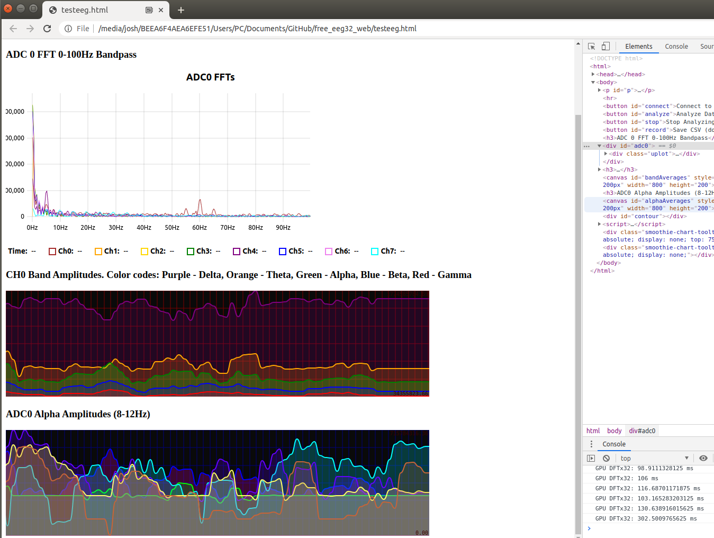

# free_eeg32_web
[FreeEEG32](https://github.com/neuroidss/freeeeg32_beta) javascript instance using the new Web Serial API (new chromium feature). I get full speed no problemo

Open testeeg.html and follow the instructions. So far only tested to work on Ubuntu (linux), Windows had connection errors but it should work in theory, as well as on Mac.

There is also my own GPU FFT solution in testeeg.html which is fast enough to run a bandpass FFT on all channels simultaneously in less than 50ms - 100ms on average (tested on RTX 2060). I'll make an animation to demo real time browser visualization.

Below is an image of a working plotter test, showing a 0-100Hz bandpass on 1 second of data, and then the isolated alpha frequencies. as well as the different bands on a single channel.
You can see a peak at 60Hz which is from AC power interference, and a simulated Alpha peak by tapping on the electrodes really fast :-P

It works!!!

