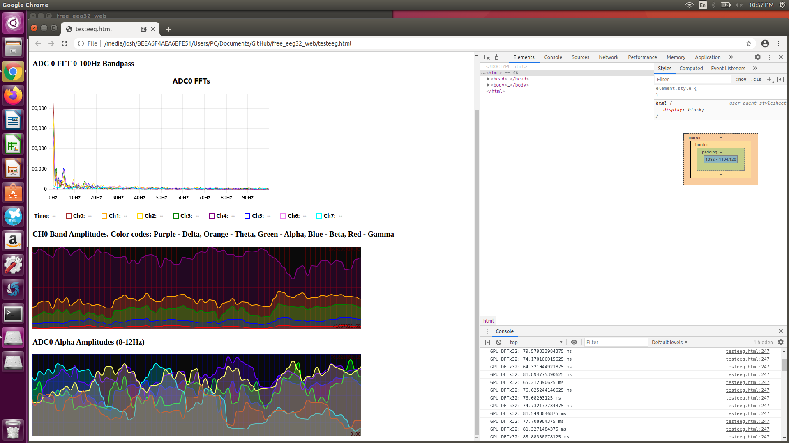

# free_eeg32_web
[FreeEEG32](https://github.com/neuroidss/freeeeg32_beta) javascript instance using the new Web Serial API (new chromium feature). 

## Purpose

To make a snappy no-bullshit EEG interface with some nice signal analysis tools. Nothing is final.

## Javascript EEG Utilities

This is still being organized and added to but the core functions are there to start doing some fun stuff with the EEG

testeeg.html

* graphing and ux testing. e.g. brain heat map with channel assignment and streaming multi channel data with different settings
* this is gonna turn into a nice UI module for working with the EEG

There are two main classes you should know about.

eeg32 in eeg32.js
* Contains all necessary functions to connect to, parse, and organize the EEG32 data.
* Increasing number of simple but essential signal analysis functions:

Class instance functions:

`var eegclass = new eeg32();`

`eegclass.setupSerialAsync()` - asks for your serial port.
`eegclass.makeAtlas10_20()` - makes an MNI atlas with tags for standard 10_20 electrode placements. It contains a data substructure for organizing channel FFT data.
`eegclass.newAtlas(tags,coords)` - make a new MNI atlas with the tags and 3D coords via an array of Array(3)'s. 

There are a couple handlers you can customize in the serial streaming to handle updates on the front end.
* `eegclass.onDecoded = () => {console.log("decoded!");}`
* `eegclass.onConnectedCallback = () => {console.log("port connected!");}`

Static functions:
* `eeg32.genSineWave(sampleRate, frequency, seconds, frequency2 (optional));` - generates a sine wave of the given frequencies, with array length equal to sampleRate * seconds. Frequency 2 is optional e.g. for simulating simple noise.
* `eeg32.cov2d(mat)` - 2D matrix covariance, pretty fast!
* `eeg32.crosscorrelation(arr1,arr2)` - returns the cross-correlogram for the two input signals
* `eeg32.autocorrelation(arr1)` - returns the auto-correlogram for the input signal
* `eeg32.sma(array, window)` - returns an array of the simple moving average based on the window sample size
* `eeg32.mean(array)` - reduces an array to the mean (expected value)
* `eeg32.variance(array)` - returns the variance array of the input array
* `eeg32.transpose(mat)` - 2D matrix transposing for quick maths
* `eeg32.matmul(mat1,mat2)` - 2D matrix multiplication

gpuUtils in ./utils/gpuUtils.js

* gpu.js based utilities. It's easy enough for my brain to handle
* This does the bulk of the computation work and eats FFTs for breakfast. Accomplished 128 channels * 2048 samples (4 seconds) in 50ms, averages about 70ms runtime on RTX 2060 but even works on super old laptops
* I'll try to port the autocorrelation and cross correlation functions in to do mass numbers of them in parallel (e.g. for mapping coherence networks)

`var gpu = new gpuUtils()`
* `gpu.gpuDFT(signalBuffer, nSeconds, texOut = false)` - Single channel DFT, give it a 1D array with the number of seconds of data captured and it will return a 2D array, the first index is a list of the frequency distribution (x-axis) of each amplitude, the second index is the array of amplitudes up to a max of the sample rate / 2 (the nyquist frequency of the sampling rate). 
* `gpu.MultiChannelDFT(signalBuffer, nSeconds, texOut = false)` - Multi channel DFT, input a 2D array with rows of equal widths and the number of seconds sampled. Outputs a 2D array with the frequency distribution (x-axis) in the first index and then the list of amplitudes in the second index.
* `gpu.MultiChannelDFT_BandPass(signalBuffer, nSeconds, freqStart, freqEnd, texOut = false)` - Multi channel DFT with a bandpass filter applied. Input 2D array with rows of equal widths, number of seconds, high pass frequency (lower bound), and low pass frequency (upper bound). Just set the filter to maximum nyquist sampling frequency for no low-pass filtering. Outputs a 2D array with the band pass window frequency distribution in the first index and the list of amplitudes in the next index.
* more being tested like inverse DFTs or automatic bandpass then inverse dfts, or other combinations. gpujs lets you pass textures of the outputs between kernels with ease which lowers the difficulty for real time DSP. There are also tests in the /other folder e.g. for video convolution or the 128 channel FFT benchmark

## Testing

Download this repo and extract the folder wherever. Then inside, open testeeg.html and follow the instructions. So far only tested to work with the FreeEEG32 on Ubuntu (linux), Windows had connection errors but it should work in theory, as well as on Mac. You can adapt the decoder for anything FYI.

### notes

There is also my own GPU FFT solution in testeeg.html which is fast enough to run a bandpass FFT on all channels simultaneously in less than 50ms - 100ms on average (tested on RTX 2060) even on 128 channels. The bandpass part still needs some optimizing for massive datasets but works fine for <=1 second of data at any sample rate. For multiple seconds of data it takes the product of overlapping sections on the CPU, which I should do on the GPU to make it seamless.

Below is an image of a working plotter test, showing a 0-100Hz bandpass on 1 second of data, and then the isolated alpha frequencies. as well as the different bands on a single channel.
You can see a peak at 60Hz which is from AC power interference, and a simulated Alpha peak by tapping on the electrodes really fast :-P You can see performance in the bottom right. 

I have gotten to around 40ms updates for 32 channel FFTs and the animations stay smooth enough but my version of Ubuntu has outdated drivers.

It works!!!

